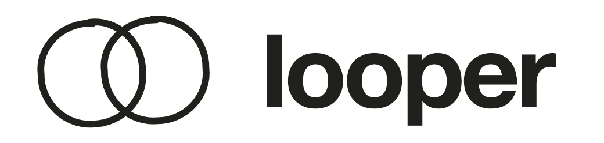
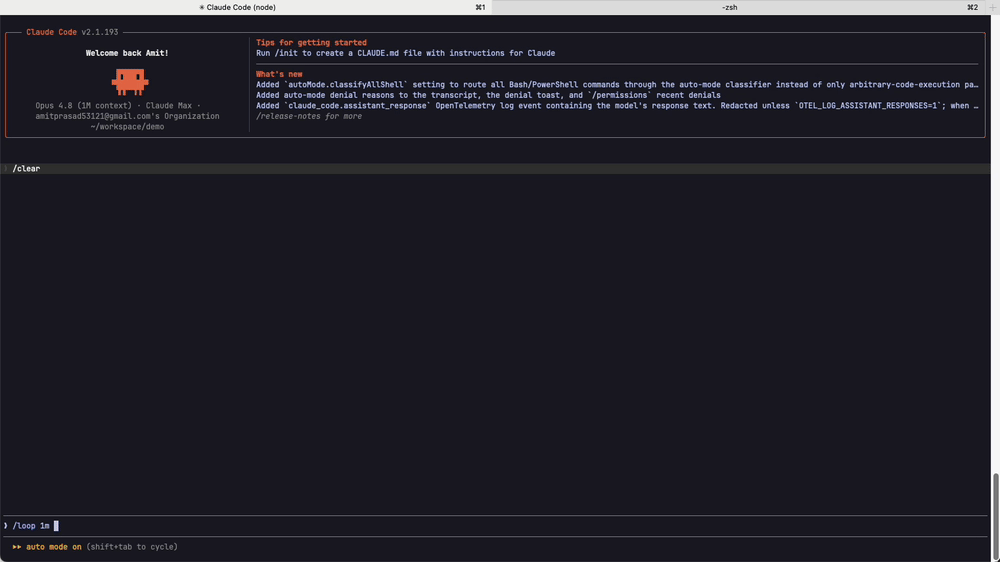
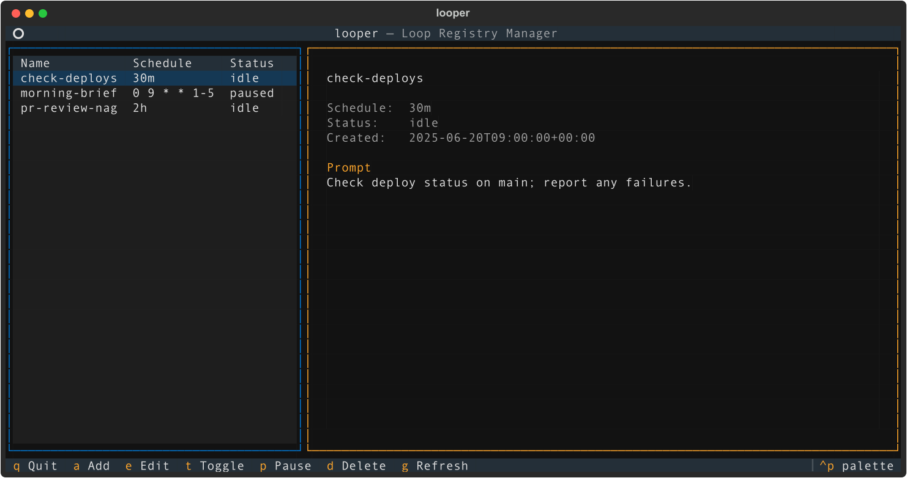

<p align="center">
  <picture>
    <source media="(prefers-color-scheme: dark)" srcset="assets/banner-dark.png">
    
  </picture>
</p>

Durable loops for Claude Code. Create a loop in plain Claude and looper keeps a persistent record of it, so you can bring it back in any future session without it firing twice when you have several sessions open.



## The problem

You set up a loop to Slack you a morning brief, check pipelines, whatever. A week later it's gone. No warning, no error. Claude Code's `CronCreate` jobs live only in memory, in one session: they die when the session closes, they auto-expire after 7 days, and nothing is written to disk. So you recreate them by hand. Every week. For every loop.

Looper fills the gaps: a durable registry of your loops, automatic capture of loops you make in Claude, and a one-owner lease so bringing them back never doubles them up.

## How it works

Three parts.

1. Capture (automatic). Make a loop the normal way: *"create a loop to check deploys every 30 minutes."* Claude schedules it with its own cron. When the turn ends, a `Stop` hook runs `looper sync`, which reads the session's live crons and writes any new ones into `~/.looper/loops.md`. No magic words, no "use looper."

2. Registry. `~/.looper/loops.md` is the source of truth, a plain markdown file you can read, edit, or manage from the CLI or TUI. It outlives sessions and the 7-day expiry.

3. Arm (one command). In a new session, run `/start-loops`. It calls `looper sync --arm`, and only the session holding the lease registers the loops. Any other open session stays quiet. That's what stops duplicate firing.

```
create loop in Claude ──Stop hook──▶ ~/.looper/loops.md ──/start-loops──▶ live cron (one owner)
        (capture)                       (durable registry)        (arm, deduped by lease)
```

## Install

```bash
uv tool install git+https://github.com/amitection/looper.git
```

Or clone and install locally:

```bash
git clone https://github.com/amitection/looper.git
cd looper && pip install .
```

Then wire it into Claude Code:

```bash
looper install
```

That creates `~/.looper/`, registers the `SessionStart`, `Stop`, and `SessionEnd` hooks in `~/.claude/settings.json`, and installs the `/start-loops`, `/stop-loops`, and `/delete-loop` commands.

## Usage

Make loops the way you already do. Run Claude's `/loop`, or just ask it to schedule a recurring task. You don't address looper at all; it watches for new crons and records them. (One catch: "create a loop" sometimes makes Claude spin up a background bash loop instead of a cron, which looper can't see. Say "recurring task" or use `/loop` and you'll get a real cron.)

Claude-side commands:

```text
# In any Claude session — captured automatically:
You: /loop 1h check my open PRs and ping me about stale ones
You: schedule a recurring task to run the test suite every morning

# Run your loops here. Claims if free; if another live session has them,
# it tells you which one and does nothing:
/start-loops

# Hand off to another session: run this where they're hosting,
# then /start-loops in the new one:
/stop-loops

# Remove a loop for good (the registry never auto-deletes):
/delete-loop check-open-prs
```

From the CLI:

```bash
looper list                                    # name, schedule, status (running/idle/paused)
looper add nightly "0 2 * * *" --prompt "..."  # add a loop by hand
looper pause <name>                            # keep it, but don't arm it
looper resume <name>
looper delete <name> --force                   # remove permanently
looper retrigger <name>                        # print a loop's prompt for a one-shot run
looper tui                                      # interactive dashboard
```

`looper list` status: running means a live session is hosting the loop, idle means it's enabled but nothing's hosting it (run `/start-loops`), paused means disabled.

The TUI (`looper tui`) — browse loops on the left, details on the right:



## Interval formats

- Shorthand: `30s`, `10m`, `1h`, `1d`
- 5-field cron: `0 9 * * 1-5`, `*/30 * * * *`

## How duplicates are prevented

`~/.looper/owner.json` is a one-owner lease. Only `/start-loops` claims it; the background hooks just capture, they never claim, so an idle session can't squat ownership. The first session to run `/start-loops` becomes the host. The lease tracks the Claude process id for liveness, so an idle-but-alive owner is never bumped.

Control only moves when you ask, never by stealing:

- Run `/start-loops` in another open session and it sees the live owner and names it ("running in the session at `…/demo`, pid 1234") rather than taking over. So loops never fire twice.
- To hand off, run `/stop-loops` in the hosting session (that drops the lease and stops its live crons), then `/start-loops` in the new one.
- When the host closes, `SessionEnd` drops the lease for you. If it crashes instead, the next `/start-loops` notices the dead pid and claims cleanly.

## loops.md format

```markdown
## check-deploys
interval: 30m
active: true
created_at: 2026-06-25T10:00:00Z

Check the latest deploy status and report any failures.

## nightly-report
interval: 0 2 * * *
active: false
paused_at: 2026-06-26T08:00:00Z

Generate the nightly metrics report.
```

Each `##` heading is a loop. The `key: value` metadata lines come first, then a blank line, then the prompt body. Loops captured from Claude get a name slugged from their prompt.

## Limitations

These come from how Claude Code works, not from looper.

Loops only fire while a Claude session is open. Claude's crons are tied to a session, so nothing runs when nothing's running.

Re-arming is one command, not silent magic. Opening a session doesn't auto-register your loops. You run `/start-loops`. It's one line and safe in any session.

A loop expires 7 days after it's created, even in a session you leave open, and looper won't renew it in place. It isn't lost, though: the registry only ever adds, never auto-removes, so the definition stays in `loops.md` and `/start-loops` re-arms it and resets the clock. Run `/start-loops` now and then (or each session) and your loops keep going.

Deleting is explicit. looper can't tell an expired cron from one you deleted on purpose, so it never removes loops on its own. Delete with `/delete-loop <name>` in Claude, or `looper delete <name> --force`. (Side effect: if you "edit" a loop in-session, Claude deletes the old cron and makes a new one, which leaves the old registry entry behind. Clear it with `/delete-loop`.)

If you want loops that fire with no session open and zero manual steps, that needs an OS-level scheduler running `claude -p` per loop. Maybe a future looper mode. For now, Claude owns the loop.

## Known issues and tradeoffs

The big one: looper is built on Claude Code(v2.1.19) behavior I observed, not on a documented contract. The hook payload shape (`session_crons`), how `CronCreate` works, the hook events, none of it is guaranteed to stay put, and it has changed before(v2.1.187). A Claude Code update could break looper. Treat it as experimental.

Scope:

- Only `CronCreate` loops are tracked. If Claude answers "create a loop" with a background bash process or anything that isn't a cron, looper never sees it. To be sure you get a tracked loop, say "schedule a recurring task…" or use `looper add`.
- Capture is best-effort. It only works when Claude reaches for `CronCreate`, and which way Claude goes depends on phrasing.

Status (`looper list` and the TUI):

- It's eventually-consistent, not live. Status comes from per-session notes on disk, so an open-but-idle session's note can lag for a bit (it might show `running` just after a loop expired, until that session's next turn).
- A loop made directly via `CronCreate` shows `running` only after that session's next hook fires, since the note is written on `Stop`.

Across sessions:

- No hot-transfer. You can't grab control from a live session. Run `/stop-loops` there first, then `/start-loops` here. This is on purpose; it's what avoids duplicates.
- If you yourself create the same loop in two sessions, both fire. The lease governs `/start-loops`, not raw `CronCreate`.
- Two loops with the same schedule and prompt collapse into one registry entry.

Runtime:

- Jitter, and crons only fire when the REPL is idle (up to ~6s late). That's Claude's cron, not looper.
- Every firing is a Claude turn, so it costs tokens.
- A dead session's process id could in theory get reused by something else, giving a rare false `running`. Unlikely.

Platform:

- One machine. The lease and per-session notes are local; this isn't built for sharing loops across machines.
- macOS and Linux. Locking uses `fcntl`; Windows would be weaker.

## File locations

| Path | Purpose |
|------|---------|
| `~/.looper/loops.md` | Durable registry, the source of truth |
| `~/.looper/owner.json` | One-owner lease (auto-managed) |
| `~/.claude/settings.json` | The `SessionStart` / `Stop` / `SessionEnd` hooks |
| `~/.claude/commands/start-loops.md` | The `/start-loops` command |
| `~/.claude/commands/stop-loops.md` | The `/stop-loops` command (hand off control) |
| `~/.claude/commands/delete-loop.md` | The `/delete-loop` command |
| `~/.looper/sessions/*.json` | Per-session cron snapshots (auto-managed) |

## License

MIT
